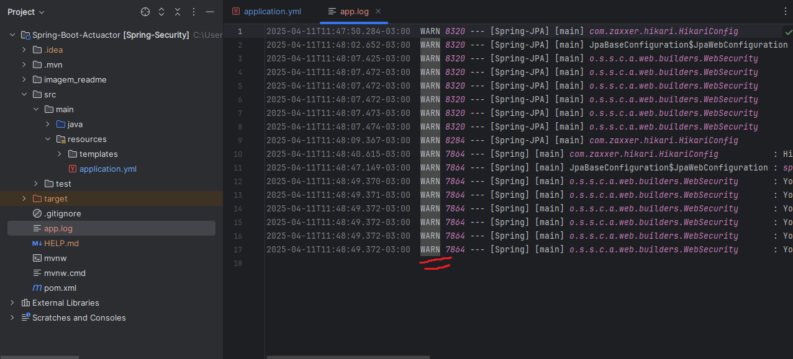
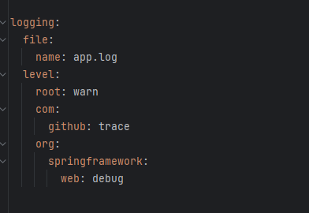
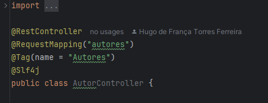

# Spring Logging e Actuator

  - [Tecnologias Usadas](#Tecnologias-Usadas)
  - [Sobre](#Sobre)
  - [Inicio](#Inicio)
  - [Logging](#Logging-Na-Prática)
  

## Tecnologias Usadas

[Java](https://www.java.com/pt-BR/) / [Spring](https://spring.io/projects/spring-boot) / [Docker](https://www.docker.com/) / [PostgresSQL](https://www.postgresql.org/) / [Pgadmin4](https://www.pgadmin.org/download/pgadmin-4-windows/) / [Thymeleaf](https://www.thymeleaf.org/) / [HTML5](https://pt.wikipedia.org/wiki/HTML5)
 / [Postman](https://www.postman.com/) / [Google Cloud](https://cloud.google.com/?hl=pt-BR) / [Swagger/OpenAPI](https://swagger.io/)

## Sobre

Implementação de logs em um sistema já estruturado para monitorar, depurar erros e exceções, entender o fluxo da aplicação, ver performance e comportamento, etc.

## Inicio

No app yamal, iremos adicionar algumas propriedades para habilitar o log:

A primeira propriedade "logging : file : name", ele irá servi para criar um arquivo de log, que nada mais é que um console de logs. Um conceito importante para se entender é sobre levels de logs, existem 5 levels: ERROR	Algo deu errado, precisa ser corrigido, WARN	Algo estranho aconteceu, mas continuou, INFO	Informação normal do fluxo da aplicação, DEBUG	Detalhes técnicos úteis pra desenvolvedores, TRACE	Mais detalhado ainda que o debug. Esses levels de logs seguem uma hierarquia em que se você utilizar um level mais permissivel ele e todos outros menos permissivel irão aparecer no console. Se por exemplo você configurar seu programa para que no console de log indique o level Warn, então só logs Warn e Erros iram aparecer:

## Logging-Na-Prática

A ideia de usar logs e para monitorar nosso sistema, metodos, etc. A melhor maneira é personalizando tipos de mensagem. Para que no console fique mais limpo, iremos adicionar um caminho até a camada que eu quero monitorar:

Depois na minha classe AutorController eu irei habilitar o log com a anotação @SLF4J:

E então em qual quer metodo eu posso adicionar mensagens como se fosse um System.out.print para que sejam capturadas no nosso console log, você pode configurar seus levels também:

[img metodo]

Depois de se autenticar e fazer a requisição via postman, no console do log ele retornará:

